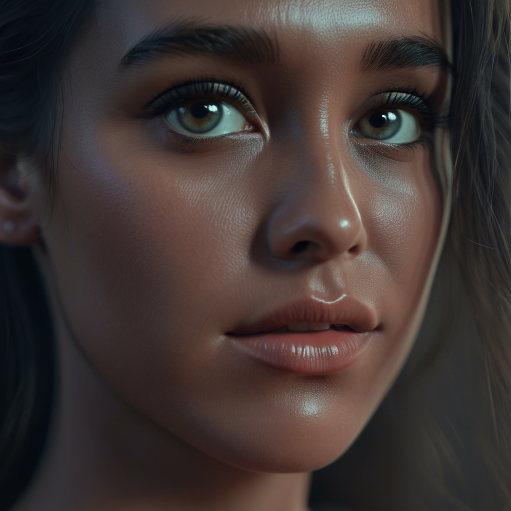
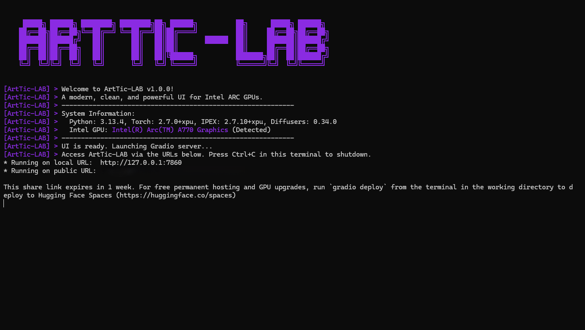

<p align="center">
  
</p>

### Your Personal AI Art Studio, Forged for Intel ARC GPUs 🚀

Tired of the messy, complex, and NVIDIA-centric world of AI image generation? So were we. ArtTic-LAB was born out of a simple desire: to have a **modern, clean, and powerful** tool that just _works_ on Intel ARC hardware, without the headaches.

This is not just another wrapper. It's a ground-up application built for performance, aesthetics, and a user-friendly experience. Welcome home, ARC creators! ✨

---

## 🌟 Key Features

- ⚡ **Blazing Fast on Intel ARC:** Optimized from the ground up with Intel's Extension for PyTorch (IPEX) to squeeze every drop of performance from your ARC GPU.
- ✨ **Sleek & Modern UI:** No more messy command lines! A beautiful and intuitive web interface lets you focus on your creativity, not the configuration.
- 🧠 **Smart Model Management:** Automatically detects SD 1.5 and SDXL models, using the correct pipeline every time. A "Refresh" button lets you add new models on the fly!
- 🎛️ **Total Creative Control:** Tweak every essential parameter:
  - Prompts & Negative Prompts
  - Image Width & Height
  - Inference Steps & Guidance Scale (CFG)
  - Seed, with a one-click randomize button 🎲
  - A selection of popular Samplers (Schedulers).
- 🖼️ **Built-in Image Gallery:** A dedicated tab to instantly view, browse, and admire all your magnificent creations.
- 🖥️ **Clean & Professional CLI:** Enjoy a completely silent and clean startup experience. The beautiful CLI only shows you what you need to see, with a power-user flag (`--disable-filters`) for when you want to see everything.

---

## Gallery of creations

Here are a few examples generated entirely with ArtTic-LAB!

|                                                                       |                                                                        |                                                                         |
| :-------------------------------------------------------------------: | :--------------------------------------------------------------------: | :---------------------------------------------------------------------: |
|     |     |     |
|  |  |  |

---

## 🚀 Getting Started

Getting up and running is as easy as 1-2-3!

### 1. Prerequisite: Install Miniconda 🐍

This project uses the Conda environment manager to keep things clean and isolated.

- If you don't have it, please install **Miniconda** for your operating system. It's a lightweight, fast installer.
- ➡️ **Download Link:** [https://docs.conda.io/en/latest/miniconda.html](https://docs.conda.io/en/latest/miniconda.html)
- After installing, **close and reopen** your terminal to make sure it's activated.

### 2. Download ArtTic-LAB 📂

Download and unzip this project to a folder on your computer.

### 3. Run the Installer Script 🛠️

This only needs to be done **once**. It will create a self-contained `ArtTic-LAB` environment and install all the magic dependencies.

- **On Windows:**
  Double-click `install.bat` or run it from your terminal.

- **On Linux/macOS:**
  Open a terminal, navigate to the ArtTic-LAB folder, and run:
  ```bash
  bash install.sh
  ```

Wait for the installation to complete. It might take a few minutes! ☕

---

## ✨ Let's Create!

After the installation is finished, you're ready to launch the studio anytime.

1.  **Run the Launcher Script:**

    - **On Windows:** Double-click `start.bat`.
    - **On Linux/macOS:** Run `bash start.sh`.

2.  Your terminal will spring to life with the beautiful ArtTic-LAB banner.

3.  It will display a **local URL**, usually `http://127.0.0.1:7860`.

4.  **Open that URL in your web browser** and start creating! 🎉

---

## The Command-Line Experience 🖥️

We believe your tools should be as beautiful under the hood as they are on the surface. Enjoy a completely clean, silent, and professional command-line interface that only shows you what matters.



Need to see the messy details for debugging? No problem! Launch with the `--disable-filters` flag to see all library logs.

- **Windows:** `start.bat --disable-filters`
- **Linux/macOS:** `bash start.sh --disable-filters`

---

## 📂 Project Structure

For the curious minds, here's how ArtTic-LAB is organized:

```

ArtTic-LAB/
├── 📁assets/ # 🖼️ Banners and demo images for the README
├── 📁helpers/ # 🛠️ Helper scripts like our awesome CLI manager
│ └── cli_manager.py
├── 📁models/ # 🧠 Drop your .safetensors models here!
├── 📁outputs/ # 🏞️ Your generated masterpieces are saved here
├── 📁pipelines/ # ⚙️ The core logic for SD 1.5 and SDXL models
│ ├── sd15_pipeline.py
│ └── sdxl_pipeline.py
├── 📜.gitignore # Tells Git what to ignore
├── 📜README.md # 👋 You are here!
├── 🐍app.py # 🚀 The main application conductor
├── 📜install.bat # 윈도우 One-click installer for Windows
├── 📜install.sh # 🐧 One-click installer for Linux/macOS
├── 📜start.bat # ▶️ The "Go" button for Windows
├── 📜start.sh # ▶️ The "Go" button for Linux/macOS
└── 🎨ui.py # ✨ The Gradio user interface code
```

---

## 🤝 Contributing & Feedback

ArtTic-LAB was built collaboratively. If you find a bug, have a great idea for a new feature, or want to contribute, feel free to open an issue on the project's repository!

## 📜 License

This project is open-source and available under the [MIT License](LICENSE).

---

###  Made with ❤️ and an Intel ARC A770. Happy creating!
