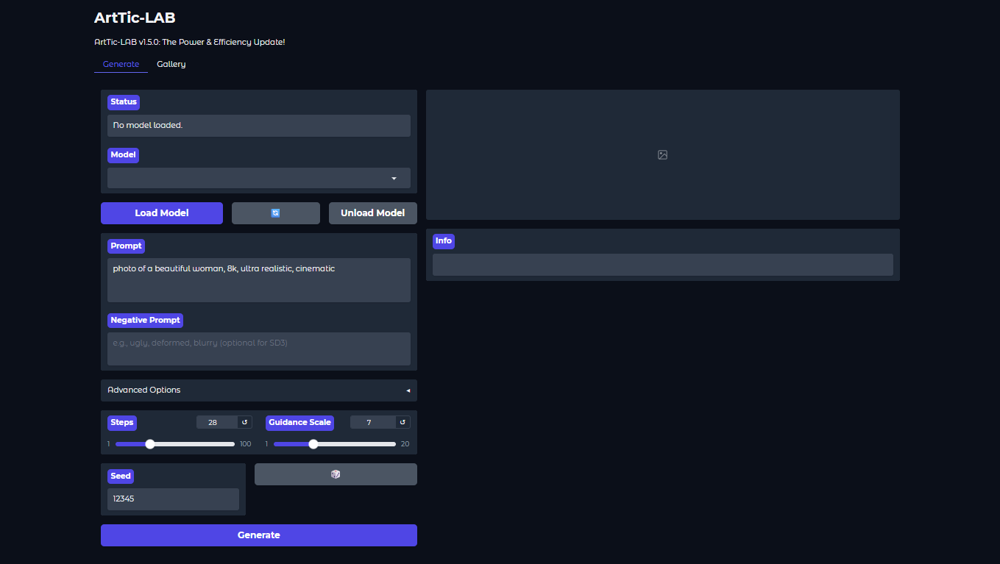

<p align="center">
  
</p>

## Your Personal AI Art Studio, Forged for Intel ARC GPUs 🚀

ArtTic-LAB is a **modern, clean, and powerful** AI image generation suite built from the ground up for Intel ARC hardware. It now features a beautiful custom user interface as the default experience, while retaining the classic Gradio UI as an option for those who prefer it.

This is not just another wrapper. It's an application built for performance, aesthetics, and a user-friendly experience, now supporting the full spectrum of Stable Diffusion models from 1.5 to the next-gen SD3. Welcome home, ARC creators! ✨

---

## 🌟 Key Features

- 🎨 **Brand New Custom UI:** A sleek, responsive, and intuitive interface is now the default way to create. Built for a fluid and focused workflow.
- ⚡ **Blazing Fast on Intel ARC:** Optimized from the ground up with Intel's Extension for PyTorch (IPEX) to squeeze every drop of performance from your ARC GPU.
- 🧠 **Universal Model Support:** Automatically detects **SD1.5, SD2.x, SDXL, and next-gen SD3** models, using the correct pipeline and settings every time.
- ⚙️ **Advanced Memory Management:**
  - **VAE Tiling** is integrated and easily toggled to prevent out-of-memory errors on high-resolution generations.
  - **CPU Offloading** for users with limited VRAM.
  - A one-click **"Unload Model"** button gives you direct control over your VRAM.
- 🎛️ **Total Creative Control:** Tweak every essential parameter: Prompts, Image Dimensions, Steps, Guidance (CFG), Seed, and a selection of popular Samplers.
- 🖼️ **Built-in Image Gallery:** A dedicated tab to instantly view, browse, download, and admire all your magnificent creations.

---

## The ArtTic-LAB Experience

We believe in clean, intuitive design. The user interface is built to be powerful yet simple, putting all the creative tools at your fingertips without the clutter.

<p align-center">
  
</p>

---

## 🚀 Getting Started

Getting up and running is as easy as 1-2-3!

### 1. Prerequisite: Install Miniconda 🐍

- If you don't have it, please install **Miniconda** for your operating system.
- ➡️ **Download Link:** [https://docs.conda.io/en/latest/miniconda.html](https://docs.conda.io/en/latest/miniconda.html)
- After installing, **close and reopen** your terminal.

### 2. Download ArtTic-LAB 📂

Download and unzip this project to a folder on your computer.

### 3. Run the Installer Script 🛠️

This only needs to be done **once**. It will create a self-contained environment and install all dependencies.

- **On Windows:** Double-click `install.bat`.
- **On Linux/macOS:** Open a terminal, navigate to the ArtTic-LAB folder, and run: `bash install.sh`

---

## ✨ Let's Create!

After installation, you're ready to launch the studio.

1.  **Run the Launcher Script:**
    - **On Windows:** Double-click `start.bat`.
    - **On Linux/macOS:** Run `bash start.sh`.

2.  Your terminal will display the ArtTic-LAB banner. It will provide a **local URL**, usually `http://127.0.0.1:7860`.

3.  **Open that URL in your web browser** and start creating! 🎉

### Using the Classic UI

If you prefer the original Gradio interface, you can launch it with a command-line flag.

- **Windows:** Run `start.bat --ui gradio`
- **Linux/macOS:** Run `bash start.sh --ui gradio`

---

## The Command-Line Experience 🖥️

Enjoy a completely clean, silent, and professional command-line interface that only shows you what matters.

<p align="center">
  
</p>

Need to see all the library logs for debugging? Launch with the `--disable-filters` flag. Example: `bash start.sh --disable-filters`

---

## 📂 Project Structure

```
ArtTic-LAB/
├── 📁assets/          # Banners, demos, etc.
├── 📁core/            # ✅ Core application logic, UI-agnostic
├── 📁helpers/         # Helper scripts like the CLI manager
├── 📁models/          # Drop your .safetensors models here!
├── 📁outputs/         # Your generated masterpieces
├── 📁pipelines/       # The core logic for all SD models
├── 📁web/             # ✅ All files for the new custom UI
│ ├── 📜server.py      # FastAPI backend server
│ ├── 📁static/        # CSS, JS, images for the custom UI
│ └── 📁templates/     # HTML templates
├── 📜app.py           # 🚀 The main application launcher
├── 📜ui.py            # Gradio UI layout code
...
```
---

## 🤝 Contributing & Feedback

If you find a bug, have a great idea, or want to contribute, please open an issue on the project's repository!

## 📜 License

This project is open-source and available under the [MIT License](LICENSE).