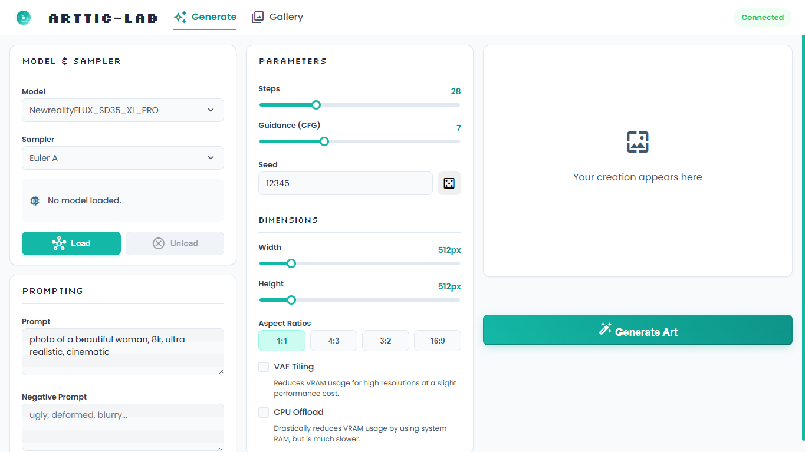
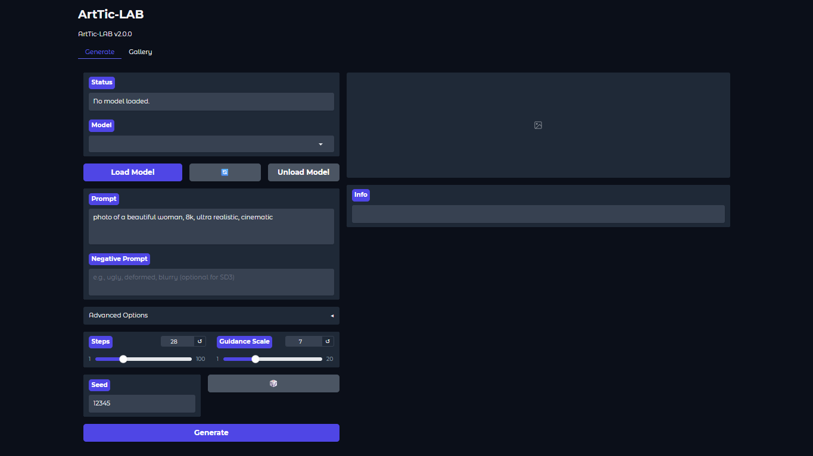
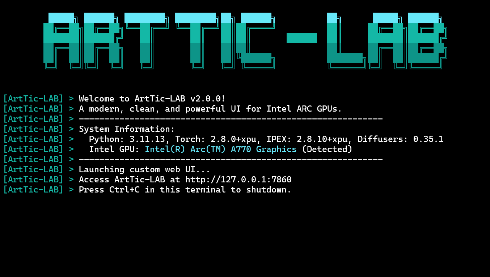
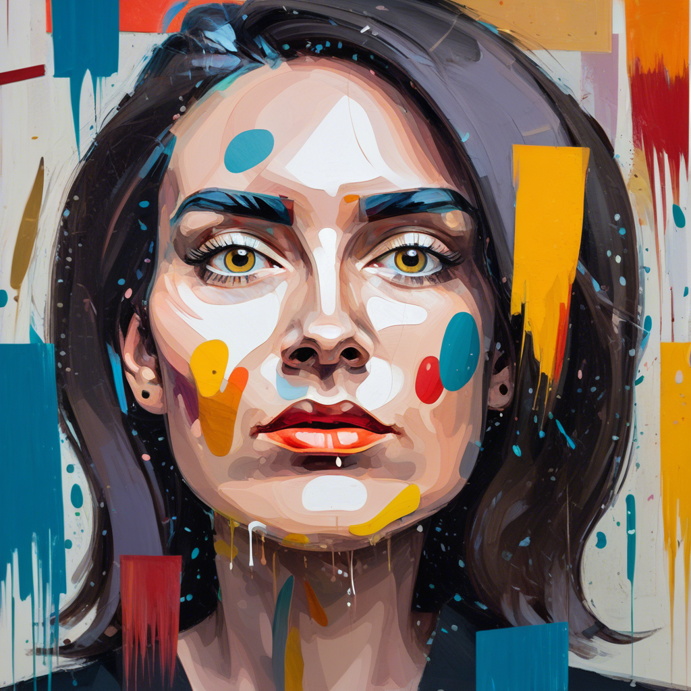

<p align="center">
  
</p>

## Your Portal to AI Artistry, Forged for Intel ARC GPUs 🎨

ArtTic-LAB is a **modern, clean, and powerful** AI image generation suite, meticulously crafted for the Intel® Arc™ hardware ecosystem. It provides a beautiful custom user interface as the primary experience, with a robust Gradio UI available as a powerful alternative.

This is more than a simple wrapper; it's a ground-up application focused on **performance, aesthetics, and a frictionless user experience**. With full support for models from Stable Diffusion 1.5 to the next-gen SD3, ArtTic-LAB is the definitive creative tool for ARC users. ✨

---

## Three Ways to Create 

ArtTic-LAB adapts to your preferred workflow, offering an interface for every kind of creator.

| The Custom UI 🎨                               | The Gradio UI 📊                                   | The CLI 💻                                     |
| :-------------------------------------------: | :-----------------------------------------------: | :------------------------------------------: |
|        |       |             |
| Our default, polished, and modern experience. | A powerful, data-science-friendly alternative.    | Clean, professional, and ideal for scripting.|

---

## Feature Deep Dive 🔬

We've packed ArtTic-LAB with features designed to maximize performance and streamline your creative process.

<div align="center">

| Feature Group                | Description                                                                                                                                                                                                                       |
| :--------------------------- | :-------------------------------------------------------------------------------------------------------------------------------------------------------------------------------------------------------------------------------- |
| **Engineered for Speed 🏎️**  | **IPEX Optimization:** We use Intel® Extension for PyTorch (IPEX) to JIT-compile and rewrite model components like the UNet and VAE, specifically optimizing them for the XPU architecture on your ARC GPU.<br>**Mixed-Precision:** All generations run in `bfloat16` for a ~2x speedup and ~50% VRAM savings with minimal quality loss. |
| **Intelligent Pipeline 🧠**  | **Automatic Detection:** No more guesswork. ArtTic-LAB peeks inside your `.safetensors` files to automatically identify the model architecture (SD1.5, SD2.x, SDXL, or SD3) and load the correct pipeline every time.<br>**Universal Support:** A unified backend ensures a consistent and stable experience across all supported model types. |
| **Total VRAM Control 💧**    | **VAE Tiling & Slicing:** Generate high-resolution images without out-of-memory errors by processing the VAE in smaller chunks.<br>**CPU Offloading:** A lifesaver for GPUs with less VRAM. Keep the model in system RAM and only move necessary parts to the GPU during inference.<br>**One-Click Unload:** Instantly free up your VRAM by fully unloading the current model without restarting the app. |
| **Streamlined for Artists ✨** | **Dual UIs:** Choose between our beautiful custom interface or the data-rich Gradio UI to suit your style.<br>**Integrated Gallery:** Your creations are automatically saved to a beautiful, built-in gallery where you can browse, admire, and download your work.<br>**Full Parameter Control:** Effortlessly adjust prompts, dimensions, steps, CFG scale, seed, samplers, and more with intuitive controls and helpful presets. |

</div>

---

## Creations Gallery 📸

Here are a few examples generated entirely with ArtTic-LAB.

|                                     |                                     |                                      |
| :---------------------------------: | :---------------------------------: | :----------------------------------: |
|        |        |         |
|        |        |         |
|  |  |  |

---

## 🚀 Get Started in Minutes

Launch your personal AI art studio with three simple steps.

#### 1️⃣ Prerequisites
-   Ensure you have **Miniconda** installed. If not, download it from the [official website](https://docs.conda.io/en/latest/miniconda.html).
-   After installation, **close and reopen** your terminal to ensure `conda` is available.

#### 2️⃣ Installation
Download and unzip this project. Then, run the one-time installer for your operating system.

-   **On Windows 🪟:** Double-click `install.bat`.
-   **On Linux/macOS 🐧:** Open a terminal in the project folder and run `bash install.sh`.

#### 3️⃣ Launch & Create!
Run the launcher script to start the server.

-   **On Windows 🪟:** Double-click `start.bat`.
-   **On Linux/macOS 🐧:** Run `bash start.sh`.

The terminal will provide a local URL (e.g., `http://127.0.0.1:7860`). Open it in your browser and let your creativity flow!

<details>
<summary><strong>👉 Optional Launch Arguments</strong></summary>

-   **Use the Classic UI:** To use the Gradio interface, launch with the `--ui gradio` flag.
    -   *Windows:* `start.bat --ui gradio`
    -   *Linux/macOS:* `bash start.sh --ui gradio`
-   **Enable Full Logs:** For debugging, launch with the `--disable-filters` flag to see all library logs.
</details>

---

## 📂 Project Structure

```
ArtTic-LAB/
├── 📁assets/          # Banners, demos, UI screenshots
├── 📁core/            # ✅ Core application logic (UI-agnostic)
├── 📁helpers/         # Helper scripts (CLI manager)
├── 📁models/          # 🧠 Drop your .safetensors models here
├── 📁outputs/         # 🏞️ Your generated masterpieces
├── 📁pipelines/       # ⚙️ Core logic for all SD model types
├── 📁web/             # ✅ All files for the custom FastAPI UI
├── 📜app.py           # 🚀 The main application launcher
├── 📜ui.py            # Gradio UI layout code
├── 📜install.bat      # 🪟 One-click installer for Windows
├── 📜start.bat        # ▶️ The "Go" button for Windows
└── 📜...              # (and other project files)
```

---

## 🤝 Contributing & Feedback

Found a bug or have a feature idea? We'd love to hear from you! Please feel free to open an issue on the project's repository.

## 📜 License

This project is open-source and available under the [MIT License](LICENSE).